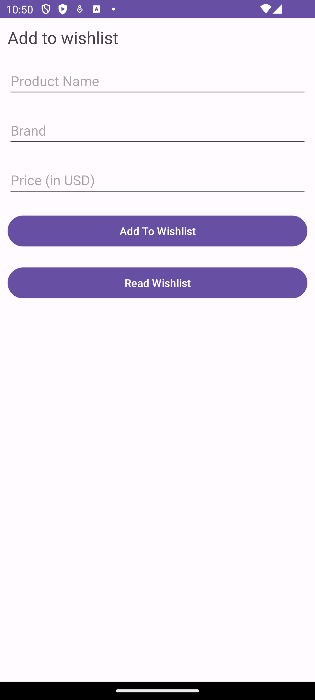
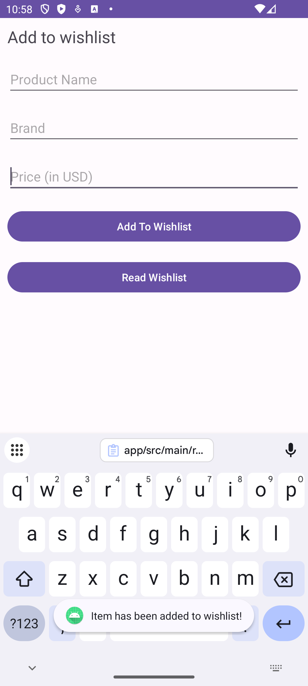
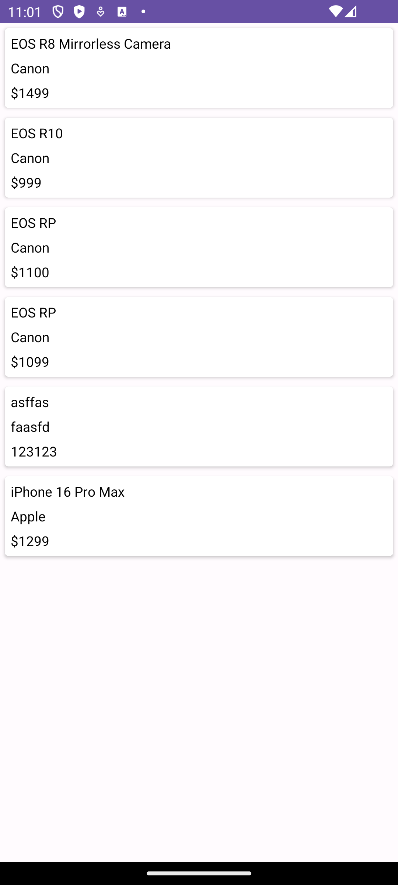
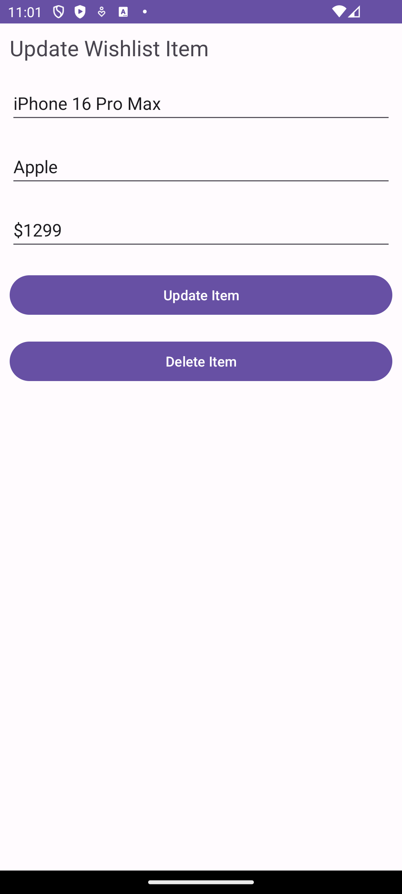

# Wishlist App
This is an application where you can add items to a wishlist. When you start the application, you are greeted with three lines of text boxes to add the information
such as the Product Name, Brand Name, and the Price.

 

Be sure to fill out all boxes, otherwise the item would not be added to the database. Once the info is filled out, click on the "Add to Wishlist" button. A popup will show indicating that the item has been added to the wishlist.

 

When clicking on the "Read Wishlist" button, you will be taken to another screen where it shows all the items you have added.

 

Clicking on one of the items takes you to another screen, where you can edit the item details, or fully delete the item.

 
